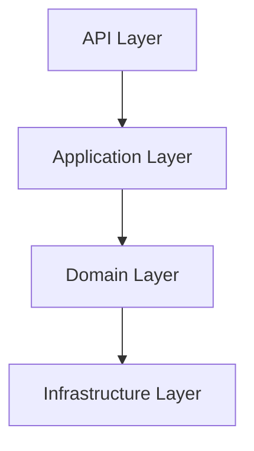
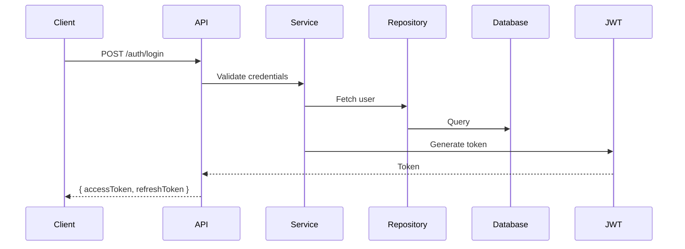
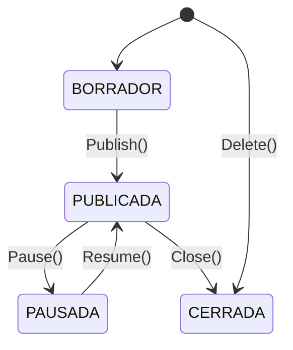

# Resumen: Workflow Spec Driven Development con Scrum

## Definición Central

**Spec-Driven Development (SDD)** es un enfoque que invierte el desarrollo tradicional: mientras el desarrollo convencional tiene el código como fuente de la verdad (Código → Documentación), SDD establece las **especificaciones como artefactos ejecutables** que generan implementaciones, eliminando la brecha entre intención y código.

## Integración con Scrum

SDD se alinea perfectamente con los sprints de Scrum mediante artefactos estructurados que mapean a cada fase del ciclo:

| Fase Scrum | Artefacto SDD | Propósito |
|------------|---------------|-----------|
| **Sprint Planning** | `spec.md` | User stories y criterios de aceptación |
| **Daily Scrum** | `tasks.md` | Tareas discretas para daily standups |
| **Sprint Review** | `plan.md` + código | Verificación contra especificación |
| **Sprint Retrospective** | `constitution.md` | Mejora continua de estándares |

## Las Tres Herramientas Complementarias

### 1. Spec Kit (github/spec-kit)
Proporciona el **flujo de trabajo estructurado** con comandos slash (`/speckit.*`) que guían desde requisitos hasta implementación:

```
/speckit.constitution → Principios del proyecto
/speckit.specify → Qué construir (requisitos)
/speckit.plan → Cómo construirlo (arquitectura)
/speckit.tasks → Pasos específicos (implementación)
/speckit.implement → Generación de código
```

### 2. AGENTS.md
Actúa como **manual operativo para agentes IA** en el proyecto. Define:
- Comandos del proyecto (`npm test`, `pnpm build`)
- Convenciones de código y estilo
- Límites claros (qué puede/modificar el agente)
- Estructura del proyecto

### 3. Agent Skills
Son **capacidades especializadas reutilizables** en `.github/skills/`. Permiten:
- Teaching agent capabilities específicas (testing, debugging, deployment)
- Templates y ejemplos adjuntos
- Carga progresiva solo cuando es relevante

## Flujo de Trabajo Integrado SDD + Scrum

El workflow SDD se integra con Scrum estructurándose en dos niveles temporales:

### Sprint 0: Foundations (Artefactos de Arquitectura)

El Sprint 0 establece la base técnica del proyecto antes de comenzar el desarrollo iterativo. Durante este sprint se generan los artefactos fundamentales que guiarán todos los sprints posteriores:

```
┌─────────────────────────────────────────────────────────────────────────┐
│                         SPRINT 0: FOUNDATIONS                           │
├─────────────────────────────────────────────────────────────────────────┤
│                                                                         │
│  ┌────────────────────┐   ┌─────────────────────┐   ┌─────────────────┐ │
│  │ 0.1 PREPARACIÓN    │──▶│ 0.2 CONSTITUCIÓN   │──▶│ 0.3 CONVENCIONES│ │
│  │    Entorno SDD     │   │    Principios       │   │    Estándares   │ │
│  │ (spec-kit init)    │   │ (.specify/)         │   │ (.specify/)     │ │
│  └────────────────────┘   └─────────────────────┘   └─────────────────┘ │
│            │                      │                       │             │
│            ▼                      ▼                       ▼             │
│  ┌────────────────────┐   ┌────────────────────┐   ┌─────────────────┐  │
│  │ 0.4 ADRs           │   │ 0.5 DIAGRAMAS      │   │ 0.6 AGENTS.md   │  │
│  │ Decisiones         │   │ Arquitectura       │   │ Configuración   │  │
│  │ Técnicas (.specify)│   │ (.specify/)        │   │ Agentes IA      │  │
│  └────────────────────┘   └────────────────────┘   └─────────────────┘  │
│                                                                         │
└─────────────────────────────────────────────────────────────────────────┘
```

**Artefactos del Sprint 0:**

| Paso | Artefacto | Descripción |
|------|-----------|-------------|
| 0.1 | Configuración SDD | `specify init`, AGENTS.md base |
| 0.2 | `constitution.md` | Principios tecnológicos, seguridad, calidad |
| 0.3 | `conventions.md` | Estándares de código detallados |
| 0.4 | `adr.md` | Decisiones arquitectónicas documentadas |
| 0.5 | `architecture/diagrams.md` | Diagramas de arquitectura general |
| 0.6 | AGENTS.md | Configuración de agentes especializados |

**Flujo del Sprint 0:**
```bash
# Paso 0.1: Inicializar SDD
specify init mi-proyecto --ai copilot

# Paso 0.2: Generar constitución
/speckit.constitution Create project constitution based on requirements

# Paso 0.3: Generar convenciones
@backend-dev Generate coding conventions based on constitution

# Paso 0.4: Documentar ADRs
@architect Document key architectural decisions as MADR format

# Paso 0.5: Generar diagramas
@diagram-dev Create architecture diagrams in Mermaid format

# Paso 0.6: Configurar AGENTS.md
# Editar AGENTS.md referencing all .specify/memory/ artifacts
```

### Sprints 1+: Desarrollo Iterativo

Los sprints subsiguientes siguen el ciclo Scrum tradicional potenciado por SDD:

```
Sprint N (2 semanas)
├── Día 1: Sprint Planning
│   ├── /speckit.specify → Genera spec.md con user stories
│   └── /speckit.plan → Crea plan técnico
├── Días 2-9: Desarrollo
│   ├── /speckit.tasks → Desglosa en tareas por día
│   ├── Daily: Tarea(s) del día según tasks.md
│   └── /speckit.implement → Implementa con Copilot
├── Día 10: Sprint Review
│   ├── Comparar código generado vs spec.md
│   └── /speckit.analyze → Verificar cumplimiento
└── Día 10: Retrospective
    ├── Actualizar constitution.md si es necesario
    └── ¿Nuevo ADR necesario? → Documentar en adr.md
```

### Flujo Completo SDD + Scrum (Vista Integrada)

```
┌─────────────────────────────────────────────────────────────────────────┐
│                    SPRINT 0: FOUNDATIONS                                │
│  ┌──────────────┐  ┌──────────────┐  ┌──────────────┐  ┌────────────┐   │
│  │ constitution │  │ conventions  │  │     adr      │  │  diagrams  │   │
│  │    .specify/ │  │    .specify/ │  │    .specify/ │  │  .specify/ │   │
│  └──────────────┘  └──────────────┘  └──────────────┘  └────────────┘   │
└─────────────────────────────────────────────────────────────────────────┘
                                    │
                                    ▼
┌─────────────────────────────────────────────────────────────────────────┐
│                    SPRINT 1: PRIMER FEATURE                             │
│  ┌─────────────────────────────────────────────────────────────────┐    │
│  │                    SPRINT PLANNING                              │    │
│  │  /speckit.specify → spec.md  │  /speckit.plan → plan.md         │    │
│  └─────────────────────────────────────────────────────────────────┘    │
│                                    │                                    │
│                                    ▼                                    │
│  ┌─────────────────────────────────────────────────────────────────┐    │
│  │                    DAILY DEVELOPMENT                            │    │
│  │  /speckit.tasks → tasks.md  │  /speckit.implement → código      │    │
│  └─────────────────────────────────────────────────────────────────┘    │
│                                    │                                    │
│                                    ▼                                    │
│  ┌──────────────────────┐   ┌────────────────────────────────────────┐  │
│  │  SPRINT REVIEW       │   │  SPRINT RETROSPECTIVE                  │  │
│  │  /speckit.analyze    │   │  Actualizar constitution/adr si es     │  │
│  │  vs spec.md          │   │  necesario                             │  │
│  └──────────────────────┘   └────────────────────────────────────────┘  │
└─────────────────────────────────────────────────────────────────────────┘
                                    │
                                    ▼
                         (Repetir para cada Sprint)
```

## Beneficios Clave

- **Contexto persistente**: Especificaciones, planes y tareas se almacenan como archivos markdown, creando un registro permanente
- **Trazabilidad completa**: Cada línea de código puede rastrearse a un requisito específico
- **Colaboración mejorada**: Equipos comparten artefactos en `specs/001-feature/`
- **Validación automatizada**: CI/CD puede verificar cumplimiento de especificaciones
- **IA contextualizada**: Copilot siempre tiene contexto del proyecto vía AGENTS.md y skills

## Artefactos Principales

| Archivo | Descripción | Persistente |
|---------|-------------|-------------|
| `constitution.md` | Principios no negociables del proyecto | ✅ |
| `spec.md` | Requisitos funcionales y no funcionales | ✅ |
| `plan.md` | Arquitectura y decisiones técnicas | ✅ |
| `tasks.md` | Elementos de trabajo accionables | ✅ |
| `AGENTS.md` | Instrucciones para agentes IA | ✅ |
| `.github/skills/` | Capacidades especializadas | ✅ |

## Artefactos de Arquitectura (SDD)

Además de los artefactos Scrum, SDD define artefactos de arquitectura que documentan decisiones técnicas y estándares del proyecto. Estos artefactos se generan típicamente en el **Sprint 0** o cuando el equipo identifica la necesidad de documentar decisiones técnicas.

### Conventions (Convenciones de Código)

**Propósito:** Estandarizar cómo escribe código el equipo, manteniendo consistencia en todo el codebase

**Ubicación SDD:** `.specify/memory/conventions.md`

**Cuándo generarlo:**
- Sprint 0 ( Foundations)
- Cuando el equipo adopta nuevos estándares
- En retrospective si hay inconsistencias detectadas

**Contenido típico:**
```
conventions.md
├── Naming Conventions
│   ├── Clases: PascalCase
│   ├── Interfaces: IPascalCase
│   ├── Métodos: PascalCase
│   ├── Propiedades: PascalCase
│   ├── Variables: camelCase
│   └── Campos privados: _camelCase
├── Estructura de Clases
│   ├── Regiones (usings, namespace, class declaration, fields, constructors, properties, methods)
│   ├── Longitud máxima de métodos
│   └── Profundidad máxima de nesting
├── XML Documentation
│   ├── /// <summary> para todos los públicos
│   ├── /// <param> para parámetros
│   └── /// <returns> para valores de retorno
├── Patrones de Error Handling
│   ├── Excepciones custom命名规则
│   ├── Formato de mensajes de error
│   └── Logging estructurado
└── Convenciones de Async
    ├── Async suffix en métodos
    └── CancellationToken usage
```

### ADRs (Architecture Decision Records)

**Propósito:** Documentar decisiones técnicas significativas con su contexto, decisión y consecuencias

**Ubicación SDD:** `.specify/memory/adr.md`

**Cuándo generarlo:**
- Cuando se toma una decisión técnica importante
- Antes de implementar una tecnología nueva
- Cuando hay múltiples opciones y se escoge una

**Formato MADR (Markdown ADR):**
```markdown
# ADR-[NÚMERO]: [Título de la decisión]

## Contexto y Problema
[Descripción del problema que motivó la decisión]

## Decisiones Consideradas
- [Opción 1]: [Pros/Contras]
- [Opción 2]: [Pros/Contras]
- [Opción N]: [Pros/Contras]

## Decisión
[Decisión tomada con justificación]

## Consecuencias
- **Positivas:**
  - [Beneficio 1]
- **Negativas:**
  - [Coste 1]
- **Neutrales:**
  - [Impacto 1]

## Relacionado con
- Constitución: `.specify/memory/constitution.md` (sección Technology Standards)
- Especificaciones relacionadas: `specs/[feature]/spec.md`
```

### Diagrams (Diagramas de Arquitectura)

**Propósito:** Visualizar estructuras y flujos del sistema para facilitar comprensión del equipo

**Ubicación SDD:**
- **General:** `.specify/memory/architecture/diagrams.md` (arquitectura global)
- **Por feature:** `specs/[feature]/diagrams.md` (flujos específicos)

**Cuándo generarlo:**
- Cuando se necesita visualizar un flujo complejo
- En Sprint 0 para arquitectura general
- Cuando se añade un nuevo feature con interacciones nuevas

**Tipos de Diagramas Mermaid:**
```markdown
## Arquitectura de Capas


## Flujo de Autenticación


## Ciclo de Vida de Entidad


### Tabla Resumen de Artefactos SDD

| Artefacto | Ubicación SDD | Generado por | Cuándo |
|-----------|---------------|--------------|--------|
| `constitution.md` | `.specify/memory/` | `/speckit.constitution` | Sprint 0 |
| `conventions.md` | `.specify/memory/` | Prompt especializado | Sprint 0 / Post-planning |
| `adr.md` | `.specify/memory/` | Prompt especializado | Decisión técnica |
| `diagrams.md` (global) | `.specify/memory/architecture/` | Prompt especializado | Sprint 0 |
| `spec.md` | `specs/[feature]/` | `/speckit.specify` | Planning |
| `plan.md` | `specs/[feature]/` | `/speckit.plan` | Planning |
| `tasks.md` | `specs/[feature]/` | `/speckit.tasks` | Post-planning |
| `diagrams.md` (feature) | `specs/[feature]/` | Prompt especializado | Durante desarrollo |

## Copilot como Asistente para Artefactos Scrum

Copilot puede asistir activamente en la generación de artefactos Scrum, potenciando cada fase del ciclo con IA contextualizada.

### Product Backlog y Épicas

```markdown
# Copilot: Generar épica desde requirement summary
/speckit.specify Create an epic for user authentication and authorization system.
The system needs email/password login, social login (Google, GitHub),
MFA support, role-based access control, and session management.
```

**Resultado**: `specs/001-auth-epic/spec.md` con épica completa dividida en historias de usuario.

### Historias de Usuario con Formato SMART

```markdown
# Copilot: Convertir requirement a historia de usuario
/speckit.specify As a registered user, I want to reset my password via email
so that I can regain access to my account if I forget my credentials.
Include: email verification, token expiration (24h), password strength requirements.
```

**Resultado**: Historia de usuario con criterios de aceptación y definición de done.

### Criterios de Aceptación Detallados

```markdown
# Copilot: Expandir criterios de aceptación
/speckit.clarify Based on the spec.md for password reset,
identify gaps in acceptance criteria and suggest edge cases:
- What happens if email is not registered?
- Rate limiting requirements?
- Security logging requirements?
```

**Resultado**: Lista de criterios de aceptación completos con edge cases.

### Sprint Planning

```markdown
# Copilot: Crear sprint backlog desde épica
/speckit.plan Use the existing authentication epic (spec.md).
Select stories that can be completed in 2-week sprint.
Prioritize: Login form → Email verification → Password reset.
Tech stack: .NET 8, React 18, Azure AD B2C.
```

**Resultado**: `plan.md` con arquitectura y secuencia de implementación.

### Daily Standups - Tareas Desglosadas

```markdown
# Copilot: Generar tareas para el día
/speckit.tasks Generate granular tasks for implementing login form.
Break down into: component structure, validation logic, API integration,
error handling, accessibility, unit tests.
```

**Resultado**: `tasks.md` con tareas T001-T010 asignables en daily scrum.

### Definition of Done Automatizada

```markdown
# Copilot: Crear checklist de Definition of Done
/speckit.checklist Generate quality checklist for user story #23 (password reset):
- Unit tests > 80% coverage
- Integration tests for email flow
- Security review passed
- Documentation updated
- Acceptance criteria verified
```

**Resultado**: Checklist verificable para sprint review.

### Sprint Review - Validación Automática

```markdown
# Copilot: Verificar cumplimiento de especificación
/speckit.analyze Compare implemented code against spec.md requirements.
Check:
- All acceptance criteria have corresponding tests
- No constitution violations (security, performance)
- Code follows established patterns
```

**Resultado**: Reporte de gaps y cumplimiento.

### Sprint Retrospective - Mejora Continua

```markdown
# Copilot: Analizar retrospectiva
/speckit.constitution Analyze velocity and quality metrics from completed sprint.
Suggest constitution updates:
- If tests were skipped, increase minimum coverage
- If API response times exceeded, add performance requirement
- If blockers occurred, add process improvement
```

**Resultado**: Propuestas de actualización a `constitution.md`.

### Generación de Plantillas Específicas por Rol

```markdown
# Plantilla Scrum Master
## Queries útiles para Copilot:
- "Generate sprint retrospective template with improvement actions"
- "Create burndown chart data from completed sprint"
- "Summarize impediments from daily standups"

# Plantilla Product Owner
## Queries útiles para Copilot:
- "Priorize backlog items by business value and effort"
- "Generate release notes from completed sprint stories"
- "Create acceptance criteria checklist for feature X"

# Plantilla Developer
## Queries útiles para Copilot:
- "Break down this user story into technical tasks"
- "Generate test cases for edge cases"
- "Review code against specification requirements"
```

### Agent Skill para Scrum Workflow

`.github/skills/scrum-workflow/SKILL.md`:

````markdown
---
name: scrum-workflow
description: Generate and manage Scrum artifacts. Use when creating user stories, sprint planning, or retrospectives.
---

# Scrum Workflow Skill

## When to use this skill
- Creating or refining user stories
- Sprint planning and backlog grooming
- Generating acceptance criteria
- Sprint review and retrospective

## Generating user stories
1. Identify the feature from epic/spec.md
2. Apply format: "As a [role], I want [capability], so that [benefit]"
3. Add acceptance criteria as Gherkin (Given-When-Then)
4. Estimate story points using Fibonacci

## Sprint planning workflow
1. Review available stories from product backlog
2. Apply selection criteria (priority, dependencies, capacity)
3. Break into tasks for daily standups
4. Define sprint goal aligned with release objective

## Acceptance criteria template
```gherkin
Scenario: [Title]
  Given [initial state]
  When [action performed]
  Then [expected outcome]
```
````

## Flujo de Trabajo Completo con IA

```markdown
┌─────────────────────────────────────────────────────────────────┐
│                    PRODUCT BACKLOG                              │
│  Copilot: /speckit.specify → Genera épicas y stories            │
└─────────────────────────────────────────────────────────────────┘
                              │
                              ▼
┌─────────────────────────────────────────────────────────────────┐
│                    SPRINT PLANNING                              │
│  Copilot: /speckit.plan → Crea sprint backlog                   │
│            /speckit.tasks → Desglosa en tareas                  │
└─────────────────────────────────────────────────────────────────┘
                              │
                              ▼
┌─────────────────────────────────────────────────────────────────┐
│                    DAILY STANDUP                                │
│  Copilot: tasks.md → Proporciona tareas diarias                 │
│            /speckit.implement → Implementa según plan           │
└─────────────────────────────────────────────────────────────────┘
                              │
                              ▼
┌─────────────────────────────────────────────────────────────────┐
│                    SPRINT REVIEW                                │
│  Copilot: /speckit.analyze → Verifica vs spec.md                │
│            /speckit.checklist → Genera checklist de calidad     │
└─────────────────────────────────────────────────────────────────┘
                              │
                              ▼
┌─────────────────────────────────────────────────────────────────┐
│                    SPRINT RETROSPECTIVE                         │
│  Copilot: /speckit.constitution → Propone mejoras               │
│            AGENTS.md → Actualiza instrucciones si es necesario  │
└─────────────────────────────────────────────────────────────────┘
                              │
                              ▼
                    (Vuelve a Sprint Planning)
```

## Prompts de Referencia para Scrum

| Escenario | Prompt para Copilot |
|-----------|---------------------|
| Crear épica | `/speckit.specify Create epic for [feature area] with 5-7 user stories` |
| Refinar story | `/speckit.clarify Refine this user story and add edge cases` |
| Sprint planning | `/speckit.plan Select stories for sprint 5 based on priority and dependencies` |
| Generar tareas | `/speckit.tasks Break down story US-123 into 4-8 hour tasks` |
| Definition of done | `/speckit.checklist Create DoD checklist for API endpoint implementation` |
| Validar sprint | `/speckit.analyze Verify sprint deliverables against original spec` |
| Retrospectiva | `/speckit.constitution Analyze sprint metrics and suggest process improvements` |

Este enfoque permite que equipos Scrum mantengan calidad mientras incrementan productividad, con Copilot generando código que cumple exactamente lo especificado.
