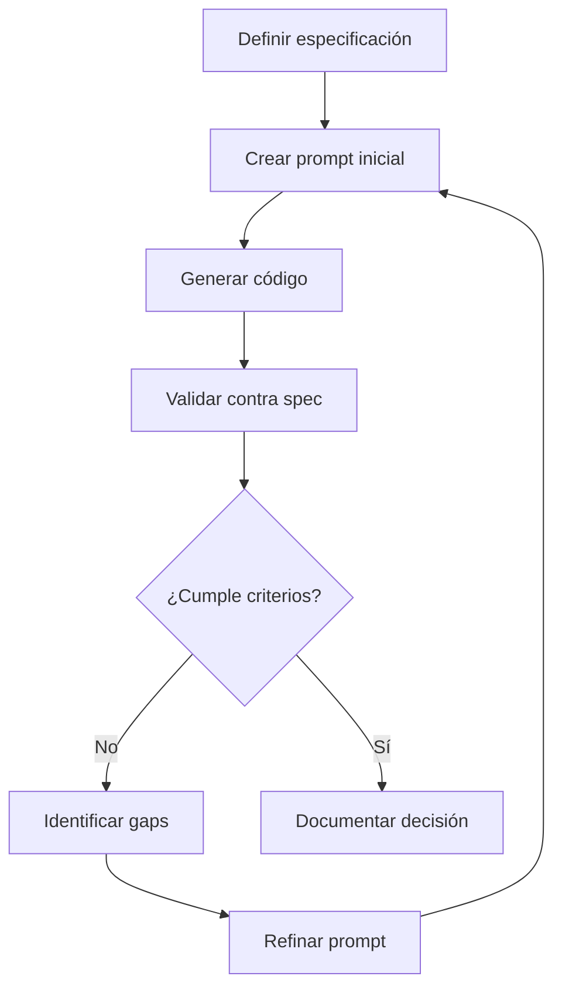

# Template: Prompt Iterativo para Refinamiento

**Contexto de uso:** Plantilla para refinar prompts basándose en resultados anteriores y especificaciones.

**Plantilla de prompt iterativo:**

```
"Basándote en la especificación en specs/001-auth-api/spec.md y el feedback anterior:

## Feedback Anterior
[Descripción de qué no funcionó]

## Especificación de Referencia
- Requisito: [ID del requisito]
- Criterios de aceptación: [lista]

## Refinamiento Solicitado
[Cambios específicos o adiciones]

## Validación Requerida
[Cómo verificar que el resultado es correcto]"
```

**Ciclo de mejora continua SDD:**



**Beneficio:** Permite mejora incremental hasta cumplir todos los criterios de aceptación.
