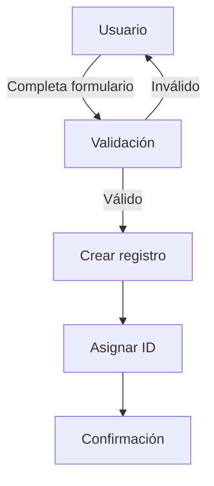

# Prompt: Diagrama de Flujo de Procesos Mermaid

**Contexto de uso:** Prompt para generar diagramas de flujo de procesos de negocio en formato Mermaid.

**Prompt para generar diagrama de flujo de procesos:**

````
"Genera un diagrama de flujo Mermaid para el proceso de creación de tareas en PortalEmpleo:

## Especificación de Referencia
- Archivo: specs/001-task-api/spec.md
- Requisito: REQ-TASK-001 (Crear tarea)
- Criterios de aceptación: CA-TASK-001, CA-TASK-002

## Proceso de Negocio
1. Usuario autenticado accede a pantalla de creación
2. Sistema muestra formulario con campos: título, descripción, fecha límite, prioridad
3. Usuario completa formulario y envía
4. Sistema valida datos:
   - Si inválido: mostrar errores, volver a paso 2
   - Si válido: continuar al paso 5
5. Sistema crea registro en base de datos
6. Sistema asigna ID único
7. Sistema retorna confirmación con enlace a tarea creada

## stakeholders
- Usuario autenticado con rol employee
- Sistema de autenticación
- Base de datos de tareas
- Sistema de notificaciones (para futuro)

## Formato de Salida


Incluye manejo de errores y paths alternativos"
````

**Dónde guardar:** `specs/[feature]/design-prompts.md` o `specs/[feature]/diagrams.md`

**Diagrama generado guardado en:** `docs/diagrams/` o `specs/[feature]/assets/`
