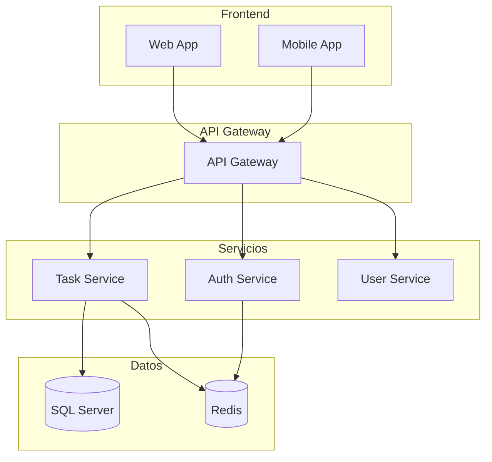

# Prompt: Diagrama C4 de Arquitectura de Microservicios

**Contexto de uso:** Prompt para generar diagrama C4 de arquitectura de microservicios.

**Prompt para diagrama de arquitectura:**

````
"Genera diagrama C4 de arquitectura para PortalEmpleo basado en constitution.md:

## Contexto del Sistema
- PortalEmpleo: Sistema de gestión de tareas empresariales
- Usuarios: ~1000 concurrentes
- SLA: 99.5% disponibilidad, < 200ms respuesta

## Componentes Definidos en Specs
- API Gateway: Punto de entrada
- Auth Service: Autenticación JWT
- Task Service: Gestión de tareas
- User Service: Perfiles de usuario
- Notification Service: Emails y push (future)
- SQL Server: Base de datos principal
- Redis: Cache de sesiones

## Patrón Arquitectónico
- Microservicios con API Gateway
- Comunicación síncrona REST
- Base de datos por servicio
- Cache distribuido

## Formato de Salida

````

**Componentes del diagrama:**

| Componente | Responsabilidad |
|------------|-----------------|
| API Gateway | Punto de entrada, routing |
| Auth Service | Autenticación JWT |
| Task Service | Gestión de tareas |
| SQL Server | Persistencia principal |
| Redis | Cache de sesiones |
