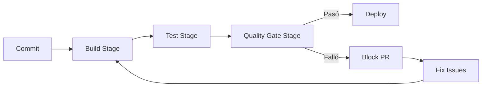

# Template: CI/CD Pipeline con Quality Gates SDD

**Contexto de uso:** Este template define el pipeline CI/CD con quality gates automatizados para Azure DevOps.

**Template Spec Kit:**

```yaml
# Template: CI/CD Pipeline con Quality Gates SDD

trigger:
  - main
  - develop

variables:
  - group: PortalEmpleo-Variables
  - name: solution
    value: 'PortalEmpleo.sln'
  - name: buildPlatform
    value: 'any cpu'
  - name: testProject
    value: 'PortalEmpleo.Tests.csproj'

stages:
  # Stage 1: Build y Análisis
  - stage: Build
    jobs:
      - job: BuildJob
        pool:
          vmImage: 'ubuntu-latest'
        steps:
          - task: UseDotNet@2
            displayName: 'Use .NET 8'
            inputs:
              packageType: 'sdk'
              version: '8.0.x'
          
          - task: DotNetCoreCLI@2
            displayName: 'Build Solution'
            inputs:
              command: 'build'
              projects: '$(solution)'
              arguments: '--configuration $(buildPlatform)'
          
          - task: DotNetCoreCLI@2
            displayName: 'Run Spec Kit Analyze'
            inputs:
              command: 'custom'
              custom: 'run'
              arguments: '--command speckit.analyze --spec specs/ --output analyze-result.json'
          
          - task: PublishPipelineArtifact@1
            displayName: 'Publish Spec Analysis'
            inputs:
              targetPath: 'analyze-result.json'
              artifact: 'spec-analysis'

  # Stage 2: Tests con Quality Gates
  - stage: Test
    dependsOn: Build
    jobs:
      - job: TestJob
        pool:
          vmImage: 'ubuntu-latest'
        steps:
          - task: DotNetCoreCLI@2
            displayName: 'Run Unit Tests'
            inputs:
              command: 'test'
              projects: '$(testProject)'
              arguments: '--configuration $(buildPlatform) --collect:"XPlat Code Coverage"'
              publishTestResults: true
          
          - task: PublishPipelineArtifact@1
            displayName: 'Publish Coverage Report'
            inputs:
              targetPath: 'TestResults/Coverage'
              artifact: 'coverage-report'

  # Stage 3: Quality Gates Validation
  - stage: QualityGate
    dependsOn: Test
    jobs:
      - job: QualityGateJob
        pool:
          vmImage: 'ubuntu-latest'
        steps:
          - download: current
            artifact: 'spec-analysis'
          
          - download: current
            artifact: 'coverage-report'
          
          - task: Bash@3
            displayName: 'Validate Quality Gates'
            env:
              COVERAGE_FILE: 'coverage-report/coverage.cobertura.xml'
            inputs:
              targetType: 'inline'
              script: |
                # Coverage Gate
                COVERAGE=$(cat coverage-report/coverage-summary.json | jq '.line_coverage')
                if (( $(echo "$COVERAGE < 80" | bc -l) )); then
                  echo "Coverage $COVERAGE% below 80% threshold"
                  exit 1
                fi
                
                # Spec Compliance Gate
                SPEC_VIOLATIONS=$(cat spec-analysis/analyze-result.json | jq '.violations | length')
                if [ "$SPEC_VIOLATIONS" -gt 0 ]; then
                  echo "Spec violations found: $SPEC_VIOLATIONS"
                  exit 1
                fi
                
                echo "All quality gates passed!"
```

**Quality Gates Spec Kit (quality-gates.json):**

```json
{
  "qualityGates": [
    {
      "name": "Coverage",
      "metric": "line_coverage",
      "threshold": 80,
      "operator": ">=",
      "blocking": true
    },
    {
      "name": "Spec Compliance",
      "metric": "spec_violations",
      "threshold": 0,
      "operator": "==",
      "blocking": true
    },
    {
      "name": "Complexity",
      "metric": "max_cyclomatic_complexity",
      "threshold": 20,
      "operator": "<=",
      "blocking": false
    },
    {
      "name": "Code Smells",
      "metric": "code_smells_high",
      "threshold": 0,
      "operator": "==",
      "blocking": true
    }
  ]
}
```

**Integración con Spec Kit:**

```bash
# 1. Generar pipeline desde template
@devops-agent Aplica template pipeline-template.yaml
              para PortalEmpleo
              según specs/001-task-api/spec.md

# 2. Configurar quality gates
/specKit.analyze --gates quality-gates.json --output gates-result.json

# 3. Validar en PR
# Azure DevOps ejecuta automáticamente:
# 1. speckit.analyze → spec-analysis
# 2. dotnet test → coverage-report
# 3. QualityGate stage → valida ambos
```

**Flujo de calidad:**


