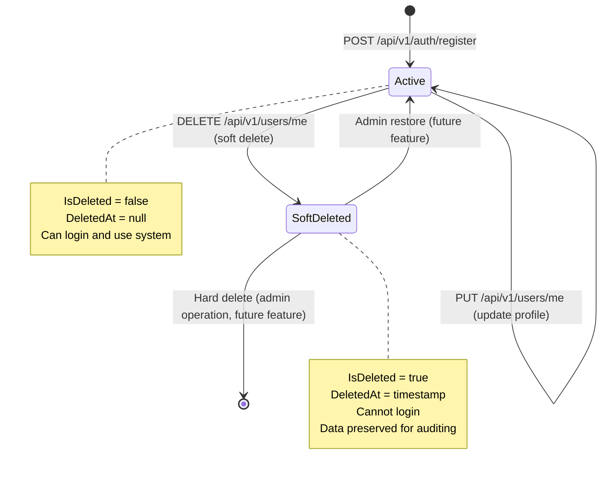
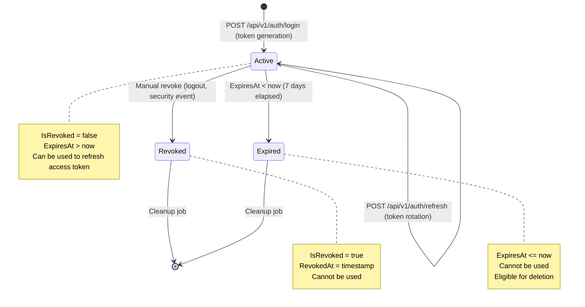

# Data Model: Gestión de Usuarios y Autenticación

**Feature**: 001-user-auth | **Date**: 2026-02-04  
**Purpose**: Definir entidades de dominio, relaciones, validation rules y configuraciones de Entity Framework Core para el módulo de autenticación.

---

## Entity Relationship Diagram

```mermaid
erDiagram
    User ||--o{ RefreshToken : "has many"
    
    User {
        Guid Id PK
        string Email UK "RFC 5322, max 255 chars"
        string PasswordHash "BCrypt hashed, max 255 chars"
        string FirstName "min 1, max 100 chars"
        string LastName "min 1, max 100 chars"
        string PhoneNumber "E.164 format, max 15 chars"
        DateTime DateOfBirth "age >= 16 years"
        UserRole Role "CANDIDATE, COMPANY, ADMIN"
        DateTime CreatedAt "UTC timestamp"
        DateTime UpdatedAt "UTC timestamp"
        bool IsDeleted "Soft delete flag"
        DateTime? DeletedAt "UTC timestamp when soft deleted"
    }
    
    RefreshToken {
        Guid Id PK
        Guid UserId FK "NOT NULL"
        string Token UK "Unique refresh token, max 500 chars"
        DateTime ExpiresAt "7 days from creation"
        DateTime CreatedAt "UTC timestamp"
        bool IsRevoked "Manual revocation flag"
        DateTime? RevokedAt "UTC timestamp when revoked"
    }
```

**Relationships**:
- User **1:N** RefreshToken - Un usuario puede tener múltiples refresh tokens (múltiples dispositivos/sesiones), pero cada token pertenece a un solo usuario
- Cascade delete: Cuando User es soft deleted, sus RefreshToken NO se eliminan (permite auditoría), pero son marcados como revocados automáticamente

---

## Domain Entities

### User Entity

**Location**: `src/PortalEmpleo.Domain/Entities/User.cs`

```csharp
using System;
using System.Collections.Generic;
using PortalEmpleo.Domain.Enums;

namespace PortalEmpleo.Domain.Entities
{
    /// <summary>
    /// Represents a user in the Portal Empleo system.
    /// Supports CANDIDATE (job seekers), COMPANY (recruiters), and ADMIN roles.
    /// </summary>
    public class User
    {
        /// <summary>
        /// Unique identifier for the user.
        /// </summary>
        public Guid Id { get; set; }
        
        /// <summary>
        /// User's email address. Must be unique and comply with RFC 5322.
        /// Immutable after creation (cannot be updated via UpdateUserDto).
        /// </summary>
        public string Email { get; set; } = string.Empty;
        
        /// <summary>
        /// BCrypt hashed password with work factor 12.
        /// Never returned in API responses or logged.
        /// </summary>
        public string PasswordHash { get; set; } = string.Empty;
        
        /// <summary>
        /// User's first name.
        /// </summary>
        public string FirstName { get; set; } = string.Empty;
        
        /// <summary>
        /// User's last name.
        /// </summary>
        public string LastName { get; set; } = string.Empty;
        
        /// <summary>
        /// User's phone number in E.164 international format (e.g., +1234567890).
        /// </summary>
        public string PhoneNumber { get; set; } = string.Empty;
        
        /// <summary>
        /// User's date of birth. Must be at least 16 years old.
        /// </summary>
        public DateTime DateOfBirth { get; set; }
        
        /// <summary>
        /// User's role in the system (CANDIDATE, COMPANY, ADMIN).
        /// </summary>
        public UserRole Role { get; set; }
        
        /// <summary>
        /// Timestamp when the user was created (UTC).
        /// </summary>
        public DateTime CreatedAt { get; set; }
        
        /// <summary>
        /// Timestamp when the user was last updated (UTC).
        /// </summary>
        public DateTime UpdatedAt { get; set; }
        
        /// <summary>
        /// Soft delete flag. When true, user is logically deleted.
        /// </summary>
        public bool IsDeleted { get; set; }
        
        /// <summary>
        /// Timestamp when the user was soft deleted (UTC). Null if not deleted.
        /// </summary>
        public DateTime? DeletedAt { get; set; }
        
        /// <summary>
        /// Navigation property for refresh tokens associated with this user.
        /// </summary>
        public virtual ICollection<RefreshToken> RefreshTokens { get; set; } = new List<RefreshToken>();
        
        /// <summary>
        /// Computed property returning full name (FirstName + LastName).
        /// </summary>
        public string FullName => $"{FirstName} {LastName}";
        
        /// <summary>
        /// Domain validation: Check if user meets minimum age requirement (16 years).
        /// </summary>
        public bool IsAgeValid()
        {
            var minDate = DateTime.UtcNow.AddYears(-16);
            return DateOfBirth < minDate;
        }
        
        /// <summary>
        /// Domain behavior: Soft delete the user.
        /// </summary>
        public void SoftDelete()
        {
            IsDeleted = true;
            DeletedAt = DateTime.UtcNow;
        }
        
        /// <summary>
        /// Domain behavior: Restore a soft deleted user.
        /// </summary>
        public void Restore()
        {
            IsDeleted = false;
            DeletedAt = null;
        }
    }
}
```

**Validation Rules** (enforced in FluentValidation + domain methods):
- `Email`: Required, unique, RFC 5322 format, max 255 chars
- `PasswordHash`: Required, BCrypt format, max 255 chars (set via service, not exposed)
- `FirstName`: Required, min 1 char, max 100 chars
- `LastName`: Required, min 1 char, max 100 chars
- `PhoneNumber`: Required, E.164 format (regex `^\+[1-9]\d{1,14}$`), max 15 chars
- `DateOfBirth`: Required, user must be ≥16 years old at creation
- `Role`: Required, must be valid enum value (CANDIDATE, COMPANY, ADMIN)
- `CreatedAt`/`UpdatedAt`: Auto-managed by EF Core interceptor
- `IsDeleted`: Defaults to false
- `DeletedAt`: Nullable, set only when `IsDeleted = true`

**EF Core Configuration** (Fluent API in `UserConfiguration.cs`):
```csharp
builder.ToTable("Users");

builder.HasKey(u => u.Id);

builder.Property(u => u.Email)
    .IsRequired()
    .HasMaxLength(255);
builder.HasIndex(u => u.Email)
    .IsUnique();

builder.Property(u => u.PasswordHash)
    .IsRequired()
    .HasMaxLength(255);

builder.Property(u => u.FirstName)
    .IsRequired()
    .HasMaxLength(100);

builder.Property(u => u.LastName)
    .IsRequired()
    .HasMaxLength(100);

builder.Property(u => u.PhoneNumber)
    .IsRequired()
    .HasMaxLength(15);

builder.Property(u => u.DateOfBirth)
    .IsRequired();

builder.Property(u => u.Role)
    .IsRequired()
    .HasConversion<string>(); // Store enum as string for readability

builder.Property(u => u.CreatedAt)
    .IsRequired()
    .HasDefaultValueSql("CURRENT_TIMESTAMP");

builder.Property(u => u.UpdatedAt)
    .IsRequired()
    .HasDefaultValueSql("CURRENT_TIMESTAMP");

builder.Property(u => u.IsDeleted)
    .IsRequired()
    .HasDefaultValue(false);

builder.Property(u => u.DeletedAt)
    .IsRequired(false);

// Soft delete global query filter
builder.HasQueryFilter(u => !u.IsDeleted);

// Relationship configuration
builder.HasMany(u => u.RefreshTokens)
    .WithOne(rt => rt.User)
    .HasForeignKey(rt => rt.UserId)
    .OnDelete(DeleteBehavior.Cascade); // Hard delete tokens when user is hard deleted
```

---

### RefreshToken Entity

**Location**: `src/PortalEmpleo.Domain/Entities/RefreshToken.cs`

```csharp
using System;

namespace PortalEmpleo.Domain.Entities
{
    /// <summary>
    /// Represents a refresh token for JWT authentication.
    /// Allows users to obtain new access tokens without re-authenticating.
    /// </summary>
    public class RefreshToken
    {
        /// <summary>
        /// Unique identifier for the refresh token.
        /// </summary>
        public Guid Id { get; set; }
        
        /// <summary>
        /// Foreign key to the User who owns this token.
        /// </summary>
        public Guid UserId { get; set; }
        
        /// <summary>
        /// The actual refresh token string (random secure string).
        /// Must be unique across all tokens.
        /// </summary>
        public string Token { get; set; } = string.Empty;
        
        /// <summary>
        /// Timestamp when the token expires (UTC). Typically 7 days from creation.
        /// </summary>
        public DateTime ExpiresAt { get; set; }
        
        /// <summary>
        /// Timestamp when the token was created (UTC).
        /// </summary>
        public DateTime CreatedAt { get; set; }
        
        /// <summary>
        /// Flag indicating if the token has been manually revoked (e.g., logout).
        /// </summary>
        public bool IsRevoked { get; set; }
        
        /// <summary>
        /// Timestamp when the token was revoked (UTC). Null if not revoked.
        /// </summary>
        public DateTime? RevokedAt { get; set; }
        
        /// <summary>
        /// Navigation property to the User who owns this token.
        /// </summary>
        public virtual User User { get; set; } = null!;
        
        /// <summary>
        /// Computed property: Check if token is currently valid (not expired, not revoked).
        /// </summary>
        public bool IsActive => !IsRevoked && ExpiresAt > DateTime.UtcNow;
        
        /// <summary>
        /// Domain behavior: Revoke the token (e.g., on logout or security event).
        /// </summary>
        public void Revoke()
        {
            IsRevoked = true;
            RevokedAt = DateTime.UtcNow;
        }
    }
}
```

**Validation Rules**:
- `UserId`: Required, must reference existing User
- `Token`: Required, unique, max 500 chars, cryptographically random (64 bytes Base64-encoded)
- `ExpiresAt`: Required, must be future date (typically CreatedAt + 7 days)
- `CreatedAt`: Required, auto-set on creation
- `IsRevoked`: Defaults to false
- `RevokedAt`: Nullable, set only when `IsRevoked = true`

**EF Core Configuration** (Fluent API in `RefreshTokenConfiguration.cs`):
```csharp
builder.ToTable("RefreshTokens");

builder.HasKey(rt => rt.Id);

builder.Property(rt => rt.Token)
    .IsRequired()
    .HasMaxLength(500);
builder.HasIndex(rt => rt.Token)
    .IsUnique();

builder.Property(rt => rt.UserId)
    .IsRequired();

builder.Property(rt => rt.ExpiresAt)
    .IsRequired();

builder.Property(rt => rt.CreatedAt)
    .IsRequired()
    .HasDefaultValueSql("CURRENT_TIMESTAMP");

builder.Property(rt => rt.IsRevoked)
    .IsRequired()
    .HasDefaultValue(false);

builder.Property(rt => rt.RevokedAt)
    .IsRequired(false);

// Relationship configuration (inverse from User)
builder.HasOne(rt => rt.User)
    .WithMany(u => u.RefreshTokens)
    .HasForeignKey(rt => rt.UserId)
    .OnDelete(DeleteBehavior.Cascade);
```

---

### UserRole Enum

**Location**: `src/PortalEmpleo.Domain/Enums/UserRole.cs`

```csharp
namespace PortalEmpleo.Domain.Enums
{
    /// <summary>
    /// Defines the roles a user can have in the Portal Empleo system.
    /// </summary>
    public enum UserRole
    {
        /// <summary>
        /// Job seeker who can apply to job offers.
        /// </summary>
        CANDIDATE = 0,
        
        /// <summary>
        /// Company recruiter who can post and manage job offers.
        /// (Out of scope for 001-user-auth, included for future use)
        /// </summary>
        COMPANY = 1,
        
        /// <summary>
        /// System administrator with full access.
        /// (Out of scope for 001-user-auth, included for future use)
        /// </summary>
        ADMIN = 2
    }
}
```

**Validation**: Stored as string in DB for readability, validated via FluentValidation against enum values.

---

## Repository Interfaces

**Location**: `src/PortalEmpleo.Domain/Interfaces/`

### IUserRepository

```csharp
using System;
using System.Collections.Generic;
using System.Threading;
using System.Threading.Tasks;
using PortalEmpleo.Domain.Entities;

namespace PortalEmpleo.Domain.Interfaces
{
    /// <summary>
    /// Repository contract for User data access operations.
    /// </summary>
    public interface IUserRepository
    {
        /// <summary>
        /// Retrieve a user by their unique identifier.
        /// </summary>
        /// <param name="id">User ID.</param>
        /// <param name="ct">Cancellation token.</param>
        /// <returns>User if found, null otherwise. Excludes soft deleted users.</returns>
        Task<User?> GetByIdAsync(Guid id, CancellationToken ct = default);
        
        /// <summary>
        /// Retrieve a user by their email address.
        /// </summary>
        /// <param name="email">User email (case-insensitive).</param>
        /// <param name="ct">Cancellation token.</param>
        /// <returns>User if found, null otherwise. Excludes soft deleted users.</returns>
        Task<User?> GetByEmailAsync(string email, CancellationToken ct = default);
        
        /// <summary>
        /// Retrieve all active users (excludes soft deleted).
        /// </summary>
        /// <param name="ct">Cancellation token.</param>
        /// <returns>Collection of active users.</returns>
        Task<IEnumerable<User>> GetAllAsync(CancellationToken ct = default);
        
        /// <summary>
        /// Add a new user to the database.
        /// </summary>
        /// <param name="user">User entity to add.</param>
        /// <param name="ct">Cancellation token.</param>
        Task AddAsync(User user, CancellationToken ct = default);
        
        /// <summary>
        /// Update an existing user in the database.
        /// </summary>
        /// <param name="user">User entity with updated properties.</param>
        /// <param name="ct">Cancellation token.</param>
        Task UpdateAsync(User user, CancellationToken ct = default);
        
        /// <summary>
        /// Soft delete a user (sets IsDeleted = true).
        /// </summary>
        /// <param name="user">User entity to soft delete.</param>
        /// <param name="ct">Cancellation token.</param>
        Task DeleteAsync(User user, CancellationToken ct = default);
    }
}
```

### IRefreshTokenRepository

```csharp
using System;
using System.Collections.Generic;
using System.Threading;
using System.Threading.Tasks;
using PortalEmpleo.Domain.Entities;

namespace PortalEmpleo.Domain.Interfaces
{
    /// <summary>
    /// Repository contract for RefreshToken data access operations.
    /// </summary>
    public interface IRefreshTokenRepository
    {
        /// <summary>
        /// Retrieve a refresh token by its token string.
        /// </summary>
        /// <param name="token">Refresh token string.</param>
        /// <param name="ct">Cancellation token.</param>
        /// <returns>RefreshToken if found, null otherwise.</returns>
        Task<RefreshToken?> GetByTokenAsync(string token, CancellationToken ct = default);
        
        /// <summary>
        /// Retrieve all active refresh tokens for a specific user.
        /// </summary>
        /// <param name="userId">User ID.</param>
        /// <param name="ct">Cancellation token.</param>
        /// <returns>Collection of active tokens (not expired, not revoked).</returns>
        Task<IEnumerable<RefreshToken>> GetActiveByUserIdAsync(Guid userId, CancellationToken ct = default);
        
        /// <summary>
        /// Add a new refresh token to the database.
        /// </summary>
        /// <param name="refreshToken">RefreshToken entity to add.</param>
        /// <param name="ct">Cancellation token.</param>
        Task AddAsync(RefreshToken refreshToken, CancellationToken ct = default);
        
        /// <summary>
        /// Update an existing refresh token (e.g., to revoke it).
        /// </summary>
        /// <param name="refreshToken">RefreshToken entity with updated properties.</param>
        /// <param name="ct">Cancellation token.</param>
        Task UpdateAsync(RefreshToken refreshToken, CancellationToken ct = default);
        
        /// <summary>
        /// Delete expired or revoked tokens for cleanup (hard delete).
        /// </summary>
        /// <param name="userId">User ID.</param>
        /// <param name="ct">Cancellation token.</param>
        Task DeleteExpiredByUserIdAsync(Guid userId, CancellationToken ct = default);
    }
}
```

### IUnitOfWork

```csharp
using System;
using System.Threading;
using System.Threading.Tasks;

namespace PortalEmpleo.Domain.Interfaces
{
    /// <summary>
    /// Unit of Work pattern for coordinating multiple repository operations
    /// within a single transaction.
    /// </summary>
    public interface IUnitOfWork : IDisposable
    {
        /// <summary>
        /// User repository instance.
        /// </summary>
        IUserRepository Users { get; }
        
        /// <summary>
        /// RefreshToken repository instance.
        /// </summary>
        IRefreshTokenRepository RefreshTokens { get; }
        
        /// <summary>
        /// Save all changes made in the current unit of work to the database.
        /// </summary>
        /// <param name="ct">Cancellation token.</param>
        /// <returns>Number of entities affected.</returns>
        Task<int> SaveChangesAsync(CancellationToken ct = default);
        
        /// <summary>
        /// Begin a database transaction.
        /// </summary>
        /// <param name="ct">Cancellation token.</param>
        Task BeginTransactionAsync(CancellationToken ct = default);
        
        /// <summary>
        /// Commit the current transaction.
        /// </summary>
        /// <param name="ct">Cancellation token.</param>
        Task CommitTransactionAsync(CancellationToken ct = default);
        
        /// <summary>
        /// Rollback the current transaction.
        /// </summary>
        /// <param name="ct">Cancellation token.</param>
        Task RollbackTransactionAsync(CancellationToken ct = default);
    }
}
```

---

## State Transitions

### User Lifecycle



### RefreshToken Lifecycle



---

## Database Indexes

**Performance Optimization**:

| Table | Column(s) | Type | Purpose |
|-------|----------|------|---------|
| Users | Email | Unique | Fast lookup by email (login), enforce uniqueness |
| Users | IsDeleted | Non-unique | Filter soft deleted users in queries |
| RefreshTokens | Token | Unique | Fast lookup by token string, enforce uniqueness |
| RefreshTokens | UserId | Non-unique | Fast retrieval of tokens by user |
| RefreshTokens | ExpiresAt | Non-unique | Fast cleanup query for expired tokens |

**EF Core Index Configuration**:
```csharp
// In UserConfiguration.cs
builder.HasIndex(u => u.Email).IsUnique();
builder.HasIndex(u => u.IsDeleted);

// In RefreshTokenConfiguration.cs
builder.HasIndex(rt => rt.Token).IsUnique();
builder.HasIndex(rt => rt.UserId);
builder.HasIndex(rt => rt.ExpiresAt);
```

---

## Database Seeding (Development Only)

**Location**: `src/PortalEmpleo.Infrastructure/Data/ApplicationDbContextSeed.cs`

```csharp
public static class ApplicationDbContextSeed
{
    public static async Task SeedAsync(ApplicationDbContext context, IPasswordHasher passwordHasher)
    {
        if (await context.Users.AnyAsync())
            return; // Already seeded
        
        var testUser = new User
        {
            Id = Guid.NewGuid(),
            Email = "test.candidate@example.com",
            PasswordHash = passwordHasher.HashPassword("Test1234"),
            FirstName = "Test",
            LastName = "Candidate",
            PhoneNumber = "+1234567890",
            DateOfBirth = new DateTime(1990, 1, 1),
            Role = UserRole.CANDIDATE,
            CreatedAt = DateTime.UtcNow,
            UpdatedAt = DateTime.UtcNow,
            IsDeleted = false
        };
        
        await context.Users.AddAsync(testUser);
        await context.SaveChangesAsync();
    }
}
```

**Usage in Program.cs** (Development environment only):
```csharp
if (app.Environment.IsDevelopment())
{
    using var scope = app.Services.CreateScope();
    var context = scope.ServiceProvider.GetRequiredService<ApplicationDbContext>();
    var passwordHasher = scope.ServiceProvider.GetRequiredService<IPasswordHasher>();
    await ApplicationDbContextSeed.SeedAsync(context, passwordHasher);
}
```

---

## Migration Strategy

### Development (In-Memory Database)
```bash
# No migrations needed - DB recreated on each startup
dotnet run --project src/PortalEmpleo.Api
```

### Production (PostgreSQL)
```bash
# 1. Change connection string in appsettings.Production.json
# 2. Generate initial migration
dotnet ef migrations add InitialCreate --project src/PortalEmpleo.Infrastructure --startup-project src/PortalEmpleo.Api

# 3. Apply migration to database
dotnet ef database update --project src/PortalEmpleo.Infrastructure --startup-project src/PortalEmpleo.Api

# 4. Deploy application
```

**Migration File Naming**: `{timestamp}_InitialCreate.cs` (EF Core generates timestamp automatically)

---

*Generated by /speckit.plan command - Phase 1 Design*
