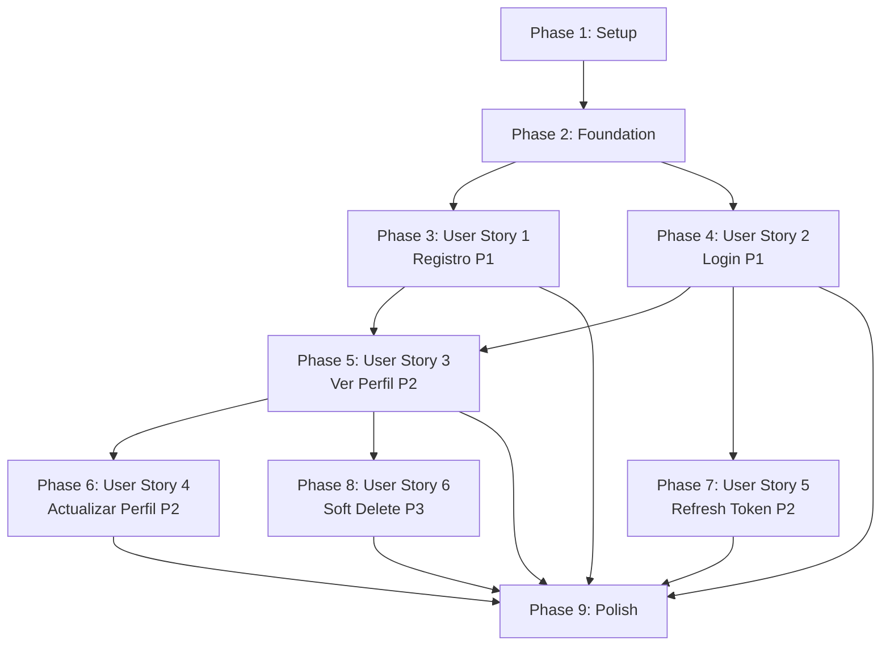

# Implementation Tasks: Gestión de Usuarios y Autenticación

**Feature**: 001-user-auth | **Branch**: `001-user-auth` | **Date**: 2026-02-04  
**Input**: [spec.md](spec.md), [plan.md](plan.md), [data-model.md](data-model.md), [research.md](research.md)

---

## Task Overview

**Total Tasks**: 87  
**Estimated Effort**: ~156 hours (~4 semanas para 1 desarrollador)  
**User Stories**: 6 (3 P1, 2 P2, 1 P3)  
**Parallelization Opportunities**: 42 tasks marcadas [P]  
**Test Coverage Target**: ≥80% para Domain, Application, Infrastructure layers

---

## Dependencies Graph

**Independent User Stories** (pueden implementarse en paralelo después de Foundation):
- User Story 1 (Registro) - NO depende de otros stories
- User Story 2 (Login) - NO depende de otros stories

**Sequential User Stories** (requieren completar previos):
- User Story 3 (Ver Perfil) - Requiere US1 + US2 completos
- User Story 4 (Actualizar Perfil) - Requiere US3 completo
- User Story 5 (Refresh Token) - Requiere US2 completo
- User Story 6 (Soft Delete) - Requiere US3 completo

---

## MVP Recommendation

**Scope**: Phase 1 (Setup) + Phase 2 (Foundation) + User Story 1 (Registro) + User Story 2 (Login)

**Justification**: 
- Permite crear cuentas y autenticar usuarios
- Funcionalidad mínima para validar arquitectura
- 37 tareas, ~66 horas (~1.5 semanas)
- Incremento testeable independientemente

---

## Phase 1: Setup (Project Initialization)

**Goal**: Crear estructura de proyectos Clean Architecture con .NET 8 y dependencias base configuradas.

**Tasks**: 10 | **Estimated Hours**: 8

- [X] T001 Crear solución .NET con `dotnet new sln -n PortalEmpleo` en raíz del repositorio
- [X] T002 [P] Crear proyecto Domain `dotnet new classlib -n PortalEmpleo.Domain -f net8.0` en src/
- [X] T003 [P] Crear proyecto Application `dotnet new classlib -n PortalEmpleo.Application -f net8.0` en src/
- [X] T004 [P] Crear proyecto Infrastructure `dotnet new classlib -n PortalEmpleo.Infrastructure -f net8.0` en src/
- [X] T005 [P] Crear proyecto Api `dotnet new webapi -n PortalEmpleo.Api -f net8.0` en src/
- [X] T006 Agregar referencias de proyectos: Application → Domain, Infrastructure → Application, Api → Infrastructure
- [X] T007 [P] Instalar paquetes NuGet en Infrastructure: `Microsoft.EntityFrameworkCore.InMemory 8.0.*`, `Npgsql.EntityFrameworkCore.PostgreSQL 8.0.*`
- [X] T008 [P] Instalar paquetes NuGet en Application: `FluentValidation 11.9.*`, `FluentValidation.DependencyInjectionExtensions 11.9.*`
- [X] T009 [P] Instalar paquetes NuGet en Api: `Swashbuckle.AspNetCore 6.5.*`, `BCrypt.Net-Next 4.0.*`, `System.IdentityModel.Tokens.Jwt 7.0.*`
- [X] T010 Crear .gitignore ignorando bin/, obj/, appsettings.Development.json (según quickstart.md)

---

## Phase 2: Foundational (Blocking Prerequisites)

**Goal**: Implementar capas Domain e Infrastructure base requeridas por TODAS las user stories.

**Independent Test**: Ejecutar tests de entidades y repositorios con In-Memory DB, verificar que User y RefreshToken se persisten correctamente con validaciones.

**Tasks**: 15 | **Estimated Hours**: 18

### Domain Layer

- [X] T011 [P] Crear enum UserRole en src/PortalEmpleo.Domain/Enums/UserRole.cs (CANDIDATE=0, COMPANY=1, ADMIN=2)
- [X] T012 [P] Crear entidad User en src/PortalEmpleo.Domain/Entities/User.cs con 12 propiedades (según data-model.md)
- [X] T013 [P] Crear entidad RefreshToken en src/PortalEmpleo.Domain/Entities/RefreshToken.cs con 8 propiedades
- [X] T014 [P] Crear interface IUserRepository en src/PortalEmpleo.Domain/Interfaces/ con métodos GetByIdAsync, GetByEmailAsync, AddAsync, UpdateAsync, DeleteAsync
- [X] T015 [P] Crear interface IRefreshTokenRepository en src/PortalEmpleo.Domain/Interfaces/ con métodos GetByTokenAsync, GetActiveByUserIdAsync, AddAsync, UpdateAsync
- [X] T016 [P] Crear interface IUnitOfWork en src/PortalEmpleo.Domain/Interfaces/ con propiedades Users, RefreshTokens, SaveChangesAsync
- [X] T017 [P] Crear excepciones personalizadas en src/PortalEmpleo.Domain/Exceptions/: DuplicateEmailException, InvalidCredentialsException, UserNotFoundException

### Infrastructure Layer

- [X] T018 Crear ApplicationDbContext en src/PortalEmpleo.Infrastructure/Data/ con DbSet<User>, DbSet<RefreshToken>
- [X] T019 [P] Crear UserConfiguration (Fluent API) en src/PortalEmpleo.Infrastructure/Data/Configurations/ aplicando índices, constraints de data-model.md
- [X] T020 [P] Crear RefreshTokenConfiguration (Fluent API) en src/PortalEmpleo.Infrastructure/Data/Configurations/
- [X] T021 Implementar UserRepository en src/PortalEmpleo.Infrastructure/Repositories/ con soft delete filter en GetByIdAsync
- [X] T022 Implementar RefreshTokenRepository en src/PortalEmpleo.Infrastructure/Repositories/
- [X] T023 Implementar UnitOfWork en src/PortalEmpleo.Infrastructure/Repositories/ coordinando repositories
- [X] T024 Configurar DbContext en src/PortalEmpleo.Api/Program.cs con UseInMemoryDatabase("PortalEmpleoDev") para Development
- [X] T025 Registrar repositorios en DI en src/PortalEmpleo.Api/Extensions/ServiceCollectionExtensions.cs

---

## Phase 3: User Story 1 - Registro de Candidatos (P1)

**Story Goal**: Permitir a profesionales crear cuenta con email único, contraseña segura BCrypt, edad ≥16 años, teléfono E.164, rol CANDIDATE asignado automáticamente.

**Independent Test**: POST /api/v1/auth/register con datos válidos → 201 Created + access token + refresh token. Intentar mismo email → 409 Conflict. Contraseña débil → 400 Validation Error. Edad <16 → 400 Validation Error.

**Tasks**: 12 | **Estimated Hours**: 18

### Application Layer

- [X] T026 [P] [US1] Crear RegisterDto en src/PortalEmpleo.Application/DTOs/Auth/ con propiedades email, password, firstName, lastName, phoneNumber, dateOfBirth
- [X] T027 [P] [US1] Crear AuthResultDto en src/PortalEmpleo.Application/DTOs/Auth/ con propiedades accessToken, refreshToken, expiresAt
- [X] T028 [P] [US1] Crear RegisterDtoValidator en src/PortalEmpleo.Application/Validators/ validando email RFC 5322, password ≥8 chars + complejidad, phone E.164, age ≥16 (según research.md)
- [X] T029 [P] [US1] Crear interface IPasswordHasher en src/PortalEmpleo.Application/Interfaces/ con métodos HashPassword, VerifyPassword
- [X] T030 [P] [US1] Crear interface IJwtTokenGenerator en src/PortalEmpleo.Application/Interfaces/ con métodos GenerateAccessToken, GenerateRefreshToken
- [X] T031 [US1] Crear interface IAuthService en src/PortalEmpleo.Application/Services/ con método RegisterAsync(RegisterDto)
- [X] T032 [US1] Implementar AuthService.RegisterAsync en src/PortalEmpleo.Application/Services/AuthService.cs: validar email único, hash password BCrypt, crear User con Role.CANDIDATE, generar tokens

### Infrastructure Layer

- [X] T033 [P] [US1] Implementar BcryptPasswordHasher en src/PortalEmpleo.Infrastructure/Security/ con work factor 12 (según research.md)
- [X] T034 [P] [US1] Implementar JwtTokenGenerator en src/PortalEmpleo.Infrastructure/Security/ con HS256, claims obligatorios (sub, email, role, exp, iss, aud), expiración 60min/7días

### Api Layer

- [X] T035 [US1] Crear AuthController en src/PortalEmpleo.Api/Controllers/ con endpoint POST /api/v1/auth/register
- [X] T036 [US1] Configurar JWT settings en src/PortalEmpleo.Api/appsettings.json con SecretKey placeholder, Issuer, Audience, AccessTokenExpiryMinutes=60, RefreshTokenExpiryDays=7
- [X] T037 [US1] Registrar AuthService, PasswordHasher, JwtTokenGenerator en DI en src/PortalEmpleo.Api/Extensions/ServiceCollectionExtensions.cs

---

## Phase 4: User Story 2 - Inicio de Sesión Seguro con JWT (P1)

**Story Goal**: Autenticar usuarios con email/password, retornar JWT tokens (access 60min, refresh 7días), proteger contra brute force con lockout 15min tras 5 intentos consecutivos fallidos.

**Independent Test**: POST /api/v1/auth/login con credenciales válidas → 200 OK + tokens. Credenciales incorrectas → 401 Unauthorized. 5 intentos fallidos consecutivos → 429 Too Many Requests + mensaje "Bloqueado 15 min". Login exitoso → contador reinicia a 0.

**Tasks**: 10 | **Estimated Hours**: 16

### Application Layer

- [ ] T038 [P] [US2] Crear LoginDto en src/PortalEmpleo.Application/DTOs/Auth/ con propiedades email, password
- [ ] T039 [P] [US2] Crear LoginDtoValidator en src/PortalEmpleo.Application/Validators/ validando email formato válido, password no vacío
- [ ] T040 [US2] Agregar método LoginAsync(LoginDto) a IAuthService en src/PortalEmpleo.Application/Services/IAuthService.cs
- [ ] T041 [US2] Implementar AuthService.LoginAsync: validar usuario existe + no IsDeleted, verificar password BCrypt, generar tokens, throw InvalidCredentialsException si falla

### Infrastructure Layer

- [ ] T042 [P] [US2] Crear clase LoginAttempt en src/PortalEmpleo.Infrastructure/Security/ con propiedades FailedCount, LastAttempt, LockoutUntil, métodos IsLockedOut(), RemainingLockoutTime()
- [ ] T043 [US2] Crear RateLimitMiddleware en src/PortalEmpleo.Api/Middleware/ con ConcurrentDictionary<string, LoginAttempt> tracking por IP
- [ ] T044 [US2] Implementar lógica lockout en RateLimitMiddleware: bloquear tras 5 intentos, retornar 429 con tiempo restante, cleanup automático cada 24h

### Api Layer

- [ ] T045 [US2] Agregar endpoint POST /api/v1/auth/login a AuthController retornando AuthResultDto
- [ ] T046 [US2] Configurar middleware RateLimitMiddleware en src/PortalEmpleo.Api/Program.cs antes de UseAuthentication
- [ ] T047 [US2] Implementar tracking de intentos fallidos en AuthService: incrementar contador en InvalidCredentialsException, resetear en login exitoso

---

## Phase 5: User Story 3 - Visualización de Perfil Personal (P2)

**Story Goal**: Permitir a usuarios autenticados consultar su información personal sin exponer contraseñas, admins pueden ver perfil de cualquier usuario.

**Independent Test**: GET /api/v1/users/me con token válido → 200 OK + UserDto sin passwordHash. Sin token → 401 Unauthorized. GET /api/v1/users/{id} como admin → 200 OK. Como candidato → 403 Forbidden. Usuario soft deleted → 404 Not Found.

**Tasks**: 10 | **Estimated Hours**: 14

### Application Layer

- [ ] T048 [P] [US3] Crear UserDto en src/PortalEmpleo.Application/DTOs/Users/ con propiedades id, email, firstName, lastName, phoneNumber, dateOfBirth, role, createdAt, updatedAt (sin passwordHash)
- [ ] T049 [P] [US3] Crear interface IUserService en src/PortalEmpleo.Application/Services/ con métodos GetByIdAsync(Guid id), GetOwnProfileAsync(Guid userId)
- [ ] T050 [US3] Implementar UserService en src/PortalEmpleo.Application/Services/UserService.cs con lógica de mapeo User → UserDto, throw UserNotFoundException si no existe o IsDeleted=true

### Api Layer

- [ ] T051 [US3] Crear UsersController en src/PortalEmpleo.Api/Controllers/ con atributo [Authorize]
- [ ] T052 [US3] Agregar endpoint GET /api/v1/users/me a UsersController extrayendo userId de HttpContext.User.FindFirst("sub")
- [ ] T053 [US3] Agregar endpoint GET /api/v1/users/{id} a UsersController con atributo [Authorize(Roles = "ADMIN")]
- [ ] T054 [US3] Configurar autenticación JWT en src/PortalEmpleo.Api/Program.cs con AddAuthentication(JwtBearerDefaults.AuthenticationScheme)
- [ ] T055 [US3] Configurar validación de JWT en Program.cs: TokenValidationParameters con ValidIssuer, ValidAudience, IssuerSigningKey, ValidateLifetime=true
- [ ] T056 [US3] Agregar middleware UseAuthentication + UseAuthorization en Program.cs pipeline
- [ ] T057 [US3] Registrar UserService en DI en src/PortalEmpleo.Api/Extensions/ServiceCollectionExtensions.cs

---

## Phase 6: User Story 4 - Actualización de Perfil Personal (P2)

**Story Goal**: Permitir a usuarios autenticados actualizar firstName, lastName, phoneNumber, dateOfBirth (email inmutable), validando edad ≥16 y phone E.164.

**Independent Test**: PUT /api/v1/users/me con datos válidos → 200 OK + UserDto actualizado. Intentar cambiar email → 400 Bad Request "Email no puede modificarse". Phone inválido → 400 Validation Error. Edad <16 → 400 Validation Error.

**Tasks**: 8 | **Estimated Hours**: 12

### Application Layer

- [ ] T058 [P] [US4] Crear UpdateUserDto en src/PortalEmpleo.Application/DTOs/Users/ con propiedades firstName, lastName, phoneNumber, dateOfBirth (sin email)
- [ ] T059 [P] [US4] Crear UpdateUserDtoValidator en src/PortalEmpleo.Application/Validators/ validando firstName/lastName min 1 max 100 chars, phone E.164, age ≥16
- [ ] T060 [US4] Agregar método UpdateOwnProfileAsync(Guid userId, UpdateUserDto dto) a IUserService
- [ ] T061 [US4] Implementar UserService.UpdateOwnProfileAsync: obtener user por ID, actualizar propiedades permitidas (NO email), UpdatedAt = UtcNow, SaveChangesAsync

### Api Layer

- [ ] T062 [US4] Agregar endpoint PUT /api/v1/users/me a UsersController recibiendo UpdateUserDto
- [ ] T063 [US4] Configurar FluentValidation automática en Program.cs con AddFluentValidationAutoValidation()
- [ ] T064 [US4] Implementar mapeo de ValidationException a 400 Bad Request en ExceptionHandlingMiddleware
- [ ] T065 [US4] Agregar documentación XML para UpdateUserDto especificando "Email no es actualizable"

---

## Phase 7: User Story 5 - Renovación de Sesión sin Re-autenticación (P2)

**Story Goal**: Permitir renovar access tokens expirados usando refresh tokens válidos, implementar token rotation (nuevo refresh token revoca anterior).

**Independent Test**: POST /api/v1/auth/refresh con refresh token válido → 200 OK + nuevo access + nuevo refresh (anterior revocado). Token expirado (>7 días) → 401 Unauthorized "Token expirado". Token revocado → 401 Unauthorized "Token revocado". Token inválido → 401 Unauthorized "Token inválido".

**Tasks**: 9 | **Estimated Hours**: 14

### Application Layer

- [ ] T066 [P] [US5] Crear RefreshTokenDto en src/PortalEmpleo.Application/DTOs/Auth/ con propiedad refreshToken
- [ ] T067 [P] [US5] Crear RefreshTokenDtoValidator en src/PortalEmpleo.Application/Validators/ validando refreshToken NotEmpty
- [ ] T068 [US5] Agregar método RefreshTokenAsync(string refreshToken) a IAuthService
- [ ] T069 [US5] Implementar AuthService.RefreshTokenAsync: buscar refresh token en DB, validar no expirado/revocado, generar nuevos tokens, revocar token anterior (IsRevoked=true, RevokedAt=UtcNow), SaveChangesAsync

### Infrastructure Layer

- [ ] T070 [US5] Implementar método RevokeAsync en RefreshTokenRepository para marcar token como revocado
- [ ] T071 [US5] Crear background service CleanupExpiredTokensService en src/PortalEmpleo.Infrastructure/Services/ ejecutando cada 24h eliminando tokens con ExpiresAt < UtcNow - 7 días

### Api Layer

- [ ] T072 [US5] Agregar endpoint POST /api/v1/auth/refresh a AuthController recibiendo RefreshTokenDto
- [ ] T073 [US5] Implementar manejo de excepciones específicas (RefreshTokenExpired, RefreshTokenRevoked, InvalidRefreshToken) en ExceptionHandlingMiddleware retornando 401 con mensajes apropiados
- [ ] T074 [US5] Registrar CleanupExpiredTokensService en DI como HostedService en Program.cs

---

## Phase 8: User Story 6 - Eliminación de Cuenta (Soft Delete) (P3)

**Story Goal**: Permitir a usuarios solicitar eliminación de cuenta, marcar IsDeleted=true sin borrado físico, preservar historial, revocar todos refresh tokens activos, prevenir login.

**Independent Test**: DELETE /api/v1/users/me con token válido → 204 No Content + IsDeleted=true + todos refresh tokens revocados. Intentar login con cuenta eliminada → 401 Unauthorized "Cuenta desactivada". Historial de postulaciones permanece accesible (verificar con query directa a DB).

**Tasks**: 7 | **Estimated Hours**: 10

### Application Layer

- [ ] T075 [US6] Agregar método DeleteOwnAccountAsync(Guid userId) a IUserService
- [ ] T076 [US6] Implementar UserService.DeleteOwnAccountAsync: obtener user, llamar user.SoftDelete() (método del dominio), revocar todos RefreshTokens del usuario, SaveChangesAsync
- [ ] T077 [US6] Modificar AuthService.LoginAsync para validar !user.IsDeleted antes de generar tokens, throw AccountDeactivatedException si está eliminado

### Domain Layer

- [ ] T078 [P] [US6] Agregar métodos de dominio SoftDelete() y Restore() a entidad User en src/PortalEmpleo.Domain/Entities/User.cs (IsDeleted=true, DeletedAt=UtcNow)
- [ ] T079 [P] [US6] Crear excepción AccountDeactivatedException en src/PortalEmpleo.Domain/Exceptions/

### Api Layer

- [ ] T080 [US6] Agregar endpoint DELETE /api/v1/users/me a UsersController retornando 204 No Content
- [ ] T081 [US6] Implementar manejo de AccountDeactivatedException en ExceptionHandlingMiddleware retornando 401 con mensaje "Cuenta desactivada, contacta al administrador"

---

## Phase 9: Polish & Cross-Cutting Concerns

**Goal**: Documentación, logging, manejo de errores global, health checks, configuración CORS, optimizaciones de rendimiento.

**Tasks**: 16 | **Estimated Hours**: 22

### Documentation

- [ ] T082 [P] Agregar documentación XML a todas las clases públicas en Domain, Application, Infrastructure, Api (según AGENTS.md estándares)
- [ ] T083 [P] Configurar Swagger en Program.cs con SwaggerDoc versión v1, incluir XML comments file
- [ ] T084 [P] Agregar ejemplos de request/response a cada endpoint con atributo [ProducesResponseType]

### Logging & Monitoring

- [ ] T085 [P] Implementar CorrelationIdMiddleware en src/PortalEmpleo.Api/Middleware/ generando ID único por request, agregando a response headers
- [ ] T086 [P] Configurar Serilog structured logging en Program.cs con filtrado de propiedades sensibles (password, passwordHash, tokens)
- [ ] T087 [P] Implementar ExceptionHandlingMiddleware en src/PortalEmpleo.Api/Middleware/ capturando excepciones globales, logging con correlation ID, retornando ErrorResponse consistente

### Health & Configuration

- [ ] T088 [P] Agregar health checks en Program.cs con AddHealthChecks() + DbContext check, exponer en /health, /health/live, /health/ready
- [ ] T089 [P] Configurar CORS en Program.cs permitiendo localhost:3000, localhost:5173 para Development (según quickstart.md)
- [ ] T090 Crear appsettings.json base con placeholders para JWT settings, appsettings.Development.json excluido en .gitignore

### Performance

- [ ] T091 [P] Implementar índices en ApplicationDbContext según data-model.md: Email (unique), IsDeleted, UserId, Token (unique), ExpiresAt
- [ ] T092 [P] Configurar DbContext con EnableSensitiveDataLogging=true solo en Development, retry on failure para producción
- [ ] T093 Agregar CancellationToken a todos los métodos async de repositorios y servicios

### Testing Infrastructure

- [ ] T094 [P] Crear proyecto PortalEmpleo.Domain.Tests en tests/ con xUnit + FluentAssertions
- [ ] T095 [P] Crear proyecto PortalEmpleo.Application.Tests en tests/ con xUnit + Moq + FluentAssertions
- [ ] T096 [P] Crear proyecto PortalEmpleo.Infrastructure.Tests en tests/ con xUnit + In-Memory DB
- [ ] T097 [P] Crear proyecto PortalEmpleo.Api.Tests en tests/ con xUnit + WebApplicationFactory para integration tests

---

## Parallel Execution Examples

### During Foundation (Phase 2)
**Parallel Batch 1** (Domain Layer - 7 tasks, ~8 hours):
- T011, T012, T013, T014, T015, T016, T017 (no dependencies entre ellos)

**Parallel Batch 2** (Infrastructure Configuration - 2 tasks, ~3 hours):
- T019 (UserConfiguration), T020 (RefreshTokenConfiguration)

### During User Story 1 (Phase 3)
**Parallel Batch 1** (DTOs & Validators - 4 tasks, ~6 hours):
- T026 (RegisterDto), T027 (AuthResultDto), T028 (RegisterDtoValidator), T029 (IPasswordHasher)

**Parallel Batch 2** (Security Implementations - 2 tasks, ~4 hours):
- T033 (BcryptPasswordHasher), T034 (JwtTokenGenerator)

### During User Story 2 (Phase 4)
**Parallel Batch 1** (DTOs & Security - 3 tasks, ~5 hours):
- T038 (LoginDto), T039 (LoginDtoValidator), T042 (LoginAttempt class)

### During Polish (Phase 9)
**Parallel Batch 1** (Documentation - 3 tasks, ~4 hours):
- T082 (XML docs), T083 (Swagger config), T084 (Response examples)

**Parallel Batch 2** (Middleware & Config - 6 tasks, ~8 hours):
- T085 (CorrelationId), T086 (Serilog), T087 (Exception handling), T088 (Health checks), T089 (CORS), T091 (Indexes)

**Parallel Batch 3** (Test Projects - 4 tasks, ~6 hours):
- T094, T095, T096, T097 (no dependencies entre proyectos de test)

---

## Implementation Strategy

### MVP First (Iteración 1)
1. **Week 1-2**: Complete Phase 1 (Setup) + Phase 2 (Foundation) + US1 (Registro) + US2 (Login)
   - Entregable: Usuarios pueden registrarse y autenticarse
   - Tests: Cobertura ≥80% en Domain + Application
   - Demo: Swagger UI con endpoints funcionales

### Incremental Delivery (Iteración 2)
2. **Week 3**: Complete US3 (Ver Perfil) + US4 (Actualizar Perfil)
   - Entregable: Gestión completa de perfil
   - Tests: Integration tests con TestServer
   - Demo: CRUD completo de usuarios autenticados

### Final Features (Iteración 3)
3. **Week 4**: Complete US5 (Refresh Token) + US6 (Soft Delete) + Polish
   - Entregable: Feature completa production-ready
   - Tests: Cobertura final ≥80% + integration tests completos
   - Demo: Sistema completo con logging, health checks, documentación Swagger

---

## Task Breakdown Table

| ID | Descripción | Horas | Dependencias | Story | Paralelo |
|---|---|---|---|---|---|
| T001 | Crear solución .NET PortalEmpleo | 0.5 | - | Setup | ❌ |
| T002 | Crear proyecto Domain | 0.5 | T001 | Setup | ✅ |
| T003 | Crear proyecto Application | 0.5 | T001 | Setup | ✅ |
| T004 | Crear proyecto Infrastructure | 0.5 | T001 | Setup | ✅ |
| T005 | Crear proyecto Api | 0.5 | T001 | Setup | ✅ |
| T006 | Configurar referencias de proyectos | 1 | T002-T005 | Setup | ❌ |
| T007 | Instalar paquetes NuGet Infrastructure | 1 | T004 | Setup | ✅ |
| T008 | Instalar paquetes NuGet Application | 1 | T003 | Setup | ✅ |
| T009 | Instalar paquetes NuGet Api | 1 | T005 | Setup | ✅ |
| T010 | Crear .gitignore | 0.5 | - | Setup | ❌ |
| T011 | Crear enum UserRole | 1 | T002 | Foundation | ✅ |
| T012 | Crear entidad User | 2 | T002 | Foundation | ✅ |
| T013 | Crear entidad RefreshToken | 1.5 | T002 | Foundation | ✅ |
| T014 | Crear IUserRepository | 1.5 | T002 | Foundation | ✅ |
| T015 | Crear IRefreshTokenRepository | 1 | T002 | Foundation | ✅ |
| T016 | Crear IUnitOfWork | 1 | T014, T015 | Foundation | ✅ |
| T017 | Crear excepciones personalizadas | 1 | T002 | Foundation | ✅ |
| T018 | Crear ApplicationDbContext | 2 | T012, T013 | Foundation | ❌ |
| T019 | Crear UserConfiguration Fluent API | 2 | T018 | Foundation | ✅ |
| T020 | Crear RefreshTokenConfiguration | 1.5 | T018 | Foundation | ✅ |
| T021 | Implementar UserRepository | 2.5 | T014, T018 | Foundation | ❌ |
| T022 | Implementar RefreshTokenRepository | 2 | T015, T018 | Foundation | ❌ |
| T023 | Implementar UnitOfWork | 2 | T021, T022 | Foundation | ❌ |
| T024 | Configurar DbContext en Program.cs | 1 | T018, T005 | Foundation | ❌ |
| T025 | Registrar repositorios en DI | 1.5 | T023, T005 | Foundation | ❌ |
| T026 | Crear RegisterDto | 1 | T003 | US1 | ✅ |
| T027 | Crear AuthResultDto | 0.5 | T003 | US1 | ✅ |
| T028 | Crear RegisterDtoValidator | 2.5 | T026 | US1 | ✅ |
| T029 | Crear interface IPasswordHasher | 0.5 | T003 | US1 | ✅ |
| T030 | Crear interface IJwtTokenGenerator | 1 | T003 | US1 | ✅ |
| T031 | Crear IAuthService | 1 | T026, T027 | US1 | ❌ |
| T032 | Implementar AuthService.RegisterAsync | 3 | T031, T016 | US1 | ❌ |
| T033 | Implementar BcryptPasswordHasher | 1.5 | T029 | US1 | ✅ |
| T034 | Implementar JwtTokenGenerator | 2.5 | T030 | US1 | ✅ |
| T035 | Crear AuthController con endpoint register | 2 | T032, T005 | US1 | ❌ |
| T036 | Configurar JWT settings en appsettings | 1 | T005 | US1 | ❌ |
| T037 | Registrar servicios en DI | 1.5 | T032-T034 | US1 | ❌ |
| T038 | Crear LoginDto | 0.5 | T003 | US2 | ✅ |
| T039 | Crear LoginDtoValidator | 1 | T038 | US2 | ✅ |
| T040 | Agregar LoginAsync a IAuthService | 0.5 | T031 | US2 | ❌ |
| T041 | Implementar AuthService.LoginAsync | 3 | T040, T029 | US2 | ❌ |
| T042 | Crear clase LoginAttempt | 1.5 | T004 | US2 | ✅ |
| T043 | Crear RateLimitMiddleware | 3 | T042, T005 | US2 | ❌ |
| T044 | Implementar lógica lockout | 2.5 | T043 | US2 | ❌ |
| T045 | Agregar endpoint login a AuthController | 1.5 | T041 | US2 | ❌ |
| T046 | Configurar RateLimitMiddleware | 1 | T043 | US2 | ❌ |
| T047 | Implementar tracking intentos fallidos | 2 | T041, T043 | US2 | ❌ |
| T048 | Crear UserDto | 1 | T003 | US3 | ✅ |
| T049 | Crear IUserService | 1 | T048 | US3 | ✅ |
| T050 | Implementar UserService | 2.5 | T049, T016 | US3 | ❌ |
| T051 | Crear UsersController | 1.5 | T050, T005 | US3 | ❌ |
| T052 | Agregar endpoint GET /users/me | 2 | T051 | US3 | ❌ |
| T053 | Agregar endpoint GET /users/{id} | 2 | T051 | US3 | ❌ |
| T054 | Configurar autenticación JWT | 2 | T034, T005 | US3 | ❌ |
| T055 | Configurar validación JWT | 1.5 | T054 | US3 | ❌ |
| T056 | Agregar middleware Auth/Authz | 1 | T055 | US3 | ❌ |
| T057 | Registrar UserService en DI | 0.5 | T050 | US3 | ❌ |
| T058 | Crear UpdateUserDto | 1 | T003 | US4 | ✅ |
| T059 | Crear UpdateUserDtoValidator | 2 | T058 | US4 | ✅ |
| T060 | Agregar UpdateOwnProfileAsync a IUserService | 0.5 | T049 | US4 | ❌ |
| T061 | Implementar UpdateOwnProfileAsync | 2.5 | T060, T016 | US4 | ❌ |
| T062 | Agregar endpoint PUT /users/me | 2 | T061, T051 | US4 | ❌ |
| T063 | Configurar FluentValidation automática | 1 | T008, T005 | US4 | ❌ |
| T064 | Mapear ValidationException a 400 | 1.5 | T063 | US4 | ❌ |
| T065 | Documentar XML UpdateUserDto | 0.5 | T058 | US4 | ❌ |
| T066 | Crear RefreshTokenDto | 0.5 | T003 | US5 | ✅ |
| T067 | Crear RefreshTokenDtoValidator | 1 | T066 | US5 | ✅ |
| T068 | Agregar RefreshTokenAsync a IAuthService | 0.5 | T031 | US5 | ❌ |
| T069 | Implementar RefreshTokenAsync | 3.5 | T068, T016 | US5 | ❌ |
| T070 | Implementar RevokeAsync en repository | 1.5 | T022 | US5 | ❌ |
| T071 | Crear CleanupExpiredTokensService | 2.5 | T016 | US5 | ❌ |
| T072 | Agregar endpoint POST /auth/refresh | 1.5 | T069, T035 | US5 | ❌ |
| T073 | Manejar excepciones refresh token | 2 | T069, T087 | US5 | ❌ |
| T074 | Registrar CleanupService como HostedService | 1 | T071 | US5 | ❌ |
| T075 | Agregar DeleteOwnAccountAsync a IUserService | 0.5 | T049 | US6 | ❌ |
| T076 | Implementar DeleteOwnAccountAsync | 2.5 | T075, T016 | US6 | ❌ |
| T077 | Validar !IsDeleted en LoginAsync | 1 | T041 | US6 | ❌ |
| T078 | Agregar métodos SoftDelete/Restore a User | 1 | T012 | US6 | ✅ |
| T079 | Crear AccountDeactivatedException | 0.5 | T002 | US6 | ✅ |
| T080 | Agregar endpoint DELETE /users/me | 1.5 | T076, T051 | US6 | ❌ |
| T081 | Manejar AccountDeactivatedException | 1 | T079, T087 | US6 | ❌ |
| T082 | Documentación XML todas las clases | 4 | - | Polish | ✅ |
| T083 | Configurar Swagger con XML comments | 2 | T005 | Polish | ✅ |
| T084 | Agregar ejemplos ProducesResponseType | 3 | T082 | Polish | ✅ |
| T085 | Implementar CorrelationIdMiddleware | 2 | T005 | Polish | ✅ |
| T086 | Configurar Serilog structured logging | 3 | T005 | Polish | ✅ |
| T087 | Implementar ExceptionHandlingMiddleware | 3.5 | T005 | Polish | ✅ |
| T088 | Agregar health checks | 2 | T018, T005 | Polish | ✅ |
| T089 | Configurar CORS | 1.5 | T005 | Polish | ✅ |
| T090 | Crear appsettings base y Development | 1 | T005 | Polish | ❌ |
| T091 | Implementar índices DB | 2 | T018 | Polish | ✅ |
| T092 | Configurar DbContext para producción | 2 | T018 | Polish | ✅ |
| T093 | Agregar CancellationToken | 2.5 | T014-T016 | Polish | ❌ |
| T094 | Crear PortalEmpleo.Domain.Tests | 1.5 | T002 | Polish | ✅ |
| T095 | Crear PortalEmpleo.Application.Tests | 1.5 | T003 | Polish | ✅ |
| T096 | Crear PortalEmpleo.Infrastructure.Tests | 1.5 | T004 | Polish | ✅ |
| T097 | Crear PortalEmpleo.Api.Tests | 2 | T005 | Polish | ✅ |

**TOTAL: 87 tasks, ~156 hours**

---

*Generated by /speckit.tasks command - Ready for implementation*
